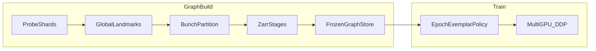
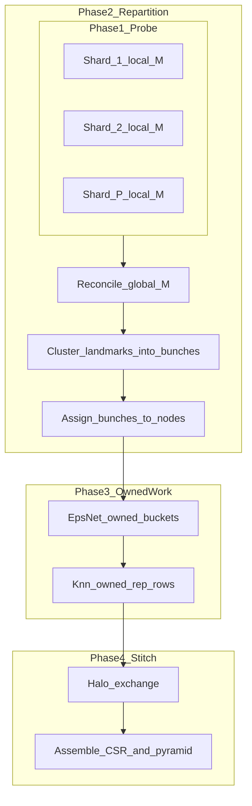
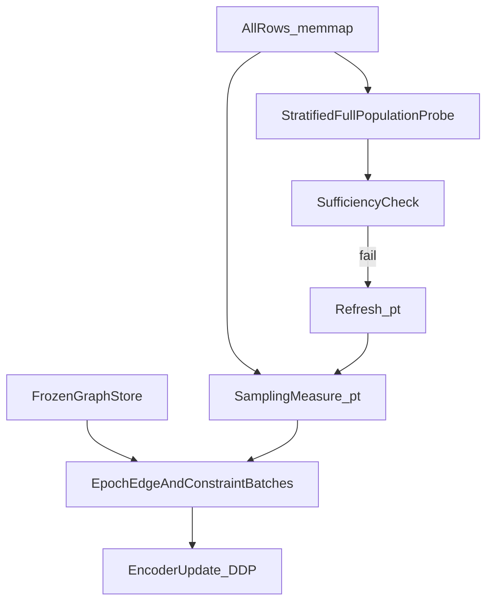

# Design: Scaling leanmap graph construction and training to 10M rows

> **Superseded for implementation** by [`leanmap_scale_design_v2.md`](leanmap_scale_design_v2.md) and the choices in [`departures_from_10m_design.md`](departures_from_10m_design.md). This file remains as historical review context.

**Status:** design proposal for external review (historical)  
**Audience:** ML systems and scientific software reviewers  
**Scope:** leanmap core APIs; motivating workload is large ambient embeddings (e.g. protein n-mer feature matrices at \(N \sim 3\times 10^5\) today, target \(N \sim 10^7\))  
**Code today:** [`src/leanmap/graph.py`](../../src/leanmap/graph.py), [`src/leanmap/graph_stages.py`](../../src/leanmap/graph_stages.py), [`src/leanmap/train.py`](../../src/leanmap/train.py), [`src/leanmap/sampler.py`](../../src/leanmap/sampler.py), optional `leanmap[hpc]` (`faiss`, `zarr`, `mpi4py`)

---

## 1. Executive summary

leanmap fits a parametric encoder against a **multi-scale neighbour graph** built in ambient feature space, then embeds new points with a forward pass. At large \(N\), peak memory occurs during **graph construction** (especially representative-scale kNN), not during path losses or encoder width.

This document proposes an architecture that makes **\(N \approx 10^7\)** feasible while preserving the scientific contract: a map that **works for the full population**, not only for a permanently reduced training subset.

**Normative lifecycle**

1. **Build** the graph (possibly distributed, always staged to disk).
2. **Freeze** it in an immutable graph store.
3. **Train** the encoder against that store; within each epoch, draw a **sufficient exemplar stream** from all data under an explicit sampling measure \(p_t\); optionally refresh \(p_t\); do **not** rebuild the graph each epoch.

**Two selection problems (do not conflate them)**

| Problem | Selects | Cadence |
|---------|---------|---------|
| **Cover** | Landmarks, ε-net representatives, edges, pyramid | Once per graph build; then frozen |
| **Exemplar stream** | Which rows appear in SGD within an epoch | Every epoch / refreshable; universe remains all rows |

**Decided principles**

- Graph topology quality and training efficiency are separate knobs.
- Disk spill + ANN are mandatory at large \(R\); changing ε or dropping the pyramid solely to save RAM is a quality regression, not a scaling strategy.
- Multi-GPU **DDP** applies to training only; graph build uses partition + stages (and optional MPI for kNN rows), not DDP.
- Partial **halo** duplication across nodes is expected; continuous cross-node landmark chatter during train is not.

---

## 2. Problem statement and scale model

### 2.1 Observed failure mode (~350k)

On a full protein 5-mer matrix (\(N \approx 3.5\times 10^5\), \(D \approx 290\)):

- Landmark pick and ε-net completed.
- Process exited **OOM (137)** in **representative-scale kNN**, before `smooth_knn` / pyramid / `graph.pt`.
- Path constraints never enter the graph builder; cutting path loss does not reduce build RAM.

Successful smaller runs (\(N \sim 10^4\)–\(4\times 10^4\)) with the **default multi-scale recipe** (ε on the order of the historical dmat default, `pyramid_scales=3`, four pyramid levels) retain geodesic Spearman in a healthy band (e.g. ~0.59 at 10k / 5 epochs, ~0.66 at 40k / 5 epochs in internal A/Bs). A “lean” recipe that raised ε and set `pyramid_scales=0` produced a **different graph** (one level, fewer reps) and weaker fidelity—evidence that **topology changes are not free compressors**.

### 2.2 Cost model (order of magnitude)

| Quantity | Role | ~350k (D~300) | ~10M (D~300) if \(R\sim N\) | 10M target regime |
|----------|------|---------------|----------------------------|-------------------|
| Feature matrix \(X\) | Ambient rows | ~0.4 GB | ~12 GB | memmap; not duplicated per worker |
| Reps \(R\) after ε-net | Graph vertices | ideally \(R\ll N\) | fatal if \(R\approx N\) | **SLO: \(R \in [10^5,10^6]\)** band unless hardware says otherwise |
| kNN tables \((R,k)\) | Neighbour lists | tens of MB | still modest if spilled | Zarr row-chunks on disk |
| Fine CSR (~15–20 deg) | Training edges | few×10⁶ edges | 10⁸-scale edges | **sharded CSR**, not one RAM-resident SciPy matrix |
| Pyramid | Multi-scale attraction | 4 levels in RAM today | must stream / reduce | fine shards + coarse levels hot |

**Anti-pattern:** exact all-pairs or fat in-RAM candidate structures over full \(R\) in one process.

### 2.3 Target SLOs

| SLO | Intent |
|-----|--------|
| Peak RSS during build | Bounded by chunk/ANN workspace + halo, not by \(O(R^2)\) or full dense tiles |
| Compression | Report \(N/R\); refuse silent “ε no-op” at 10M without an explicit override |
| Resumability | Stages survive kill mid-kNN; fingerprint mismatch forces rebuild |
| Train memory | Need not hold full fine CSR; sampler reads store shards + memmap \(X\) |
| Generalization | Probe on rows **outside** the epoch stream remains competitive with training-on-all |

---

## 3. Lifecycle architecture (normative)



| Phase | Name | Mutates graph? | Output |
|-------|------|----------------|--------|
| **A** | Graph learn / build | Yes | Stages → frozen store |
| **B** | Freeze | No (seal) | Immutable `graph.pt` or `graph_store/` |
| **C** | Train | No | `model.pt`; sampling policy \(p_t\) may change |

**Current vs proposed**

| Aspect | Current | Proposed at 10M |
|--------|---------|-----------------|
| Build/train coupling | `fit(..., graph_path=...)` already reuses a pyramid file | Same contract; build may be a separate batch job |
| Mid-build spill | `graph_stages/` Zarr (landmarks → ε-net → knn) | Mandatory; plus sharded CSR assemble |
| Distribution | Single process (+ optional MPI knn-row sketch) | Landmark-bunch ownership across nodes |
| Train data | Effectively all train-split rows via edge→cell expansion | Explicit \(p_t\) over full universe within epochs |

Job split (already mirrored in downstream Slurm sketches): **one graph-build job**, then **one or more train jobs** loading the same store.

---

## 4. Graph construction design

### 4.1 Pipeline (unchanged scientifically)

Mapped to existing code paths in [`build_graph`](../../src/leanmap/graph.py) / [`build_graph_pyramid`](../../src/leanmap/graph.py):

1. **Landmarks** \(M\) — FPS or geodesic Poisson-disk; bucket assign `top-1` / `top-c`.
2. **ε-net representatives** — greedy net **per landmark bucket**; **halo merge** across buckets whose `top-c` sets interact ([`_halo_merge`](../../src/leanmap/graph.py)).
3. **kNN on reps** — brute / IVF / ANN; at large \(R\), spill row batches to Zarr ([`graph_stages.py`](../../src/leanmap/graph_stages.py), `_knn_spill_to_stages`).
4. **smooth_knn → fuzzy union → multiplicity → landmark backbone → edges**.
5. **Pyramid coarsening** — Galerkin contraction for `pyramid_scales` levels (default multi-scale recipe).

ε-net inside a bucket already supports sub-block split/merge when a bucket exceeds `max_bucket`—a single-node preview of “local net then merge candidates.”

### 4.2 Disk stages and ANN (**current → mandatory**)

**Current:** optional `graph_stages_dir` / `PLANEConfig.graph_stages_dir`; Faiss IVF write + `IO_FLAG_MMAP` when available; resume if fingerprint matches \(X\).

**Proposed rule:** for \(R > R_{\mathrm{spill}}\) (today’s code uses ~50k for spill preference), always:

- Persist landmarks, `rep_idx` / `member_of`, `knn_idx` / `knn_dist`.
- Query ANN in batches; never hold a full dense distance block.
- Assemble CSR only after knn stage is complete (or assemble CSR itself in shards—§5).

Packaging: keep Faiss/Zarr/mpi4py behind `leanmap[hpc]` / `leanmap[cpu]`.

### 4.3 Landmark-bunch ownership (proposed distributed build)

**Idea:** do not merge \(P\) finished independent graphs. Use \(P\) **probe** builds (or landmark-only probes) to form a **global cover**, then **repartition** so each node owns disjoint **landmark bunches**, with a thin **halo**.



| Step | Parallelism | Notes |
|------|-------------|-------|
| Probe | Embarrassingly parallel | ~10k–40k style recipes that already look good; landmarks (and optional small graphs) |
| Global \(M\) | Rank 0 / single fat node | Union + dedupe / FPS on landmark pool; broadcast |
| Bunch partition | Central | Cluster landmarks; balance by **point or rep mass**, not landmark count alone |
| Assign rows | Parallel | Voronoi / `top-1` ∈ owned bunches |
| ε-net | Parallel by bunch | Same as today’s per-bucket nets |
| Halo | Boundary only | Replicate fringe rows whose `top-c` intersects a foreign bunch |
| kNN fill | Parallel by rep-row ranges | Extends `scripts/mpi_knn_fill.py` sketch |
| Fuzzy union / pyramid | Reduce | Central or hierarchical; fine graph may stay sharded (§5) |

**Rejected:** concatenating edge lists from \(P\) unrelated full graphs without a shared landmark cover (missing cross-shard neighbours, inconsistent reps).

### 4.4 Sync epochs during build only

While the cover is still being learned:

- Local work on owned interiors.
- **Barrier** when landmarks, bunch map, or cut geometry change.
- Refresh halo membership; rebuild only **dirty** bunches.
- Then **freeze**—no landmark sync during the training phase (§3).

Halo duplication is **O(cut)**, not O(\(N/P\)). If every node mirrors most of \(X\), partitioning has failed.

### 4.5 What merges cleanly vs stays global

| Clean to shard / merge | Keep global or carefully reduced |
|------------------------|----------------------------------|
| Bucket assignment | Landmark pick for global \(M\) |
| Per-bucket ε-net | Consistent rep ID remapping after halo (union-find) |
| kNN query rows → Zarr | Fuzzy symmetrisation needing global weights |
| Halo candidate pairs | Pyramid Galerkin contraction over fine graph |

---

## 5. Frozen graph store

### 5.1 Current artefact

[`save_graph_pyramid` / `load_graph_pyramid`](../../src/leanmap/train.py) writes a single file (typically `graph.pt`) containing:

- Fingerprint of training rows, metric name, `n_landmarks`, `n_neighbors`, ε, seed, dedup flag  
- `train_idx` / `calib_idx`  
- Pyramid `graphs[]` (edges, weights, knn_idx, reps, stats)  
- Landmarks \(M\), assignments  

Reload checks fingerprint and key hyperparameters; training lr/epochs can change without rebuild.

### 5.2 Proposed 10M store

Evolve `graph_path` from a single pickle to a **directory store** (name illustrative):

```text
graph_store/
  meta.json          # fingerprint, ε, L, k, metric, bunch map version
  landmarks.zarr     # M, assign tables or pointers
  reps/              # rep_idx, member_of, weights, offsets, values
  knn/               # optional durable (R,k) if needed for diagnostics
  csr/               # sharded fine edges by rep-id range or bunch id
  pyramid/           # coarse levels (small; may stay single-file)
```

**Training** opens memmap / Zarr handles; [`EdgeSampler`](../../src/leanmap/sampler.py)-class logic draws edge ids from shard metadata, then expands to ambient members via cell lists (also sharded or memmap-indexed).

### 5.3 Immutability rules

| May change without rebuild | Invalidates store (rebuild) |
|----------------------------|-----------------------------|
| `lr`, `epochs`, `lambda_path`, batch sizes, DDP world size | Ambient \(X\) fingerprint |
| Exemplar policy \(p_t\) | Metric / ε / `n_neighbors` / landmark count / seed used for graph |
| Probe / eval subsets | Dedup flag or pyramid depth if those define stored levels |

---

## 6. Training-set / within-epoch exemplar policy

### 6.1 Intent

- **Universe** = all rows (available for embed, eval, refresh).
- **Within an epoch** = draws from a sampling measure \(p_t\) that form a **sufficient exemplar stream** for updating the network of choice.
- Statistically: after training under \(p_t\), stratified or full-population probes should not collapse relative to uniform-all training on the same frozen graph.

This is **not** “delete data forever.” It is **active design of the SGD stream**.

### 6.2 Relation to mechanisms already in leanmap

- Graph vertices are **reps**; cells have **multiplicity** weights; `beta_multiplicity` reweights edges ([`docs/CONFIGURATION.md`](../CONFIGURATION.md)).
- [`EdgeSampler`](../../src/leanmap/sampler.py) samples edges then expands to **random cell members**—already a stochastic exemplar draw inside a cell.
- Proposed \(p_t\) generalizes that idea across **which edges/cells/constraints** are offered each epoch.

### 6.3 Suggested tilt of \(p_t\)

| Factor | Purpose |
|--------|---------|
| Edge / cell mass under graph | Stay faithful to frozen topology |
| Inverse visit counts | Avoid starving cells/landmarks |
| Path (and class) violation mass | Spend capacity where constraints fail |
| Diversity (farthest-first / repulsion in \(X\) or \(z\)) | Avoid burning steps on near-duplicates |
| Multiplicity-aware caps | Heavy cells contribute weight without \(w\) identical copies |

### 6.4 Refresh and invariants

Refresh \(p_t\) when sufficiency diagnostics fail, e.g.:

- Cells with graph degree but zero hits in the epoch  
- Landmark bucket mass in the stream far below population mass  
- Path triplet coverage drop  
- Growing gap between train batch metrics and a held-out probe  

**Hard invariants when refreshing**

1. Do not empty a cell that still participates in stored edges (keep ≥1 exemplar or the rep row).  
2. Maintain per-landmark mass floors in the stream.  
3. Path triplets remain resolvable (endpoints in stream, or in-cell substitutes, or triplet dropped explicitly).

### 6.5 Evaluation (“works for everything”)

Periodic **probe protocol** (rank 0):

- Embed a stratified sample over **all** landmark bunches / cells (including rows with \(p_t \approx 0\) this epoch).  
- Report geodesic / trust / path diagnostics vs the training stream.  
- Gate “policy OK” on probe degradation bounds agreed per application.



---

## 7. Multi-GPU training (DDP)

### 7.1 Scope

| In scope | Out of scope |
|----------|--------------|
| `DistributedDataParallel` on the encoder (+ learnable affinity if enabled) | DDP during ε-net / Faiss build |
| Shard **edge / path / class minibatches** across ranks | Model parallel / pipeline parallel for default widths |
| Rank-0 logging, checkpoints, probes | Replacing staged graph build |

### 7.2 Integration sketch

- `torchrun --nproc_per_node=G` entry around `fit` (or a thin `fit_ddp`).
- Each rank: load frozen store (memmap), construct samplers with `seed + rank`.
- Local batch size = `batch_edges // world_size` for fixed global batch (preferred default), or scale LR if global batch grows intentionally.
- Multiple forwards per step (positives, negatives, ordinals, path) remain; DDP scales encoder GEMMs, not host sampling—pin memory / async H2D as follow-ons.
- Terms that embed **all** landmarks (geo): compute on all ranks (identical → averaged grads ≈ scaled once) **or** rank-0-only scalar contribution with explicit scaling—pick one in implementation; document in config.

Exemplars: either a **shared** \(p_t\) with rank-sharded draws, or per-rank views of \(p_t\) with the same sufficiency invariants.

---

## 8. Phased roadmap to 10M

| Phase | Goal | Exit criterion |
|-------|------|----------------|
| **P0** | Full ~350k (or max available), **default multi-scale topology**, stages + ANN, freeze, train | `graph_store`/`graph.pt` builds; train completes; quality ≥ internal 40k-class bar where comparable |
| **P1** | 1–2M rows; compression SLO enforced; stage resume under kill | Peak RSS documented; \(N/R\) reported; rebuild-from-stage works |
| **P2** | Landmark-bunch multi-node build; Zarr knn + sharded fine CSR | Walltime scales with nodes; halo fraction ≪ 1; cut metrics logged |
| **P3** | Directory graph store + \(p_t\) exemplar policy + DDP train | Probe “works for everything” gates green; multi-GPU speedup measured |
| **P4** | 10M | Published R, cut size, halo %, build/train walltime, probe metrics |

P0–P1 can proceed on a single large-memory node. P2+ need shared filesystem semantics friendly to Zarr chunk writers (Lustre/GPFS with large row chunks).

---

## 9. Risks, alternatives considered, non-goals

### 9.1 Risks

| Risk | Mitigation |
|------|------------|
| ε no-op ⇒ \(R\approx N\) at 10M | Hard compression SLO; bucket caps; refuse silent no-op |
| Bunch cut too large | Recluster landmarks; balance by mass; measure halo fraction |
| \(p_t\) under-covers rare geometry | Probe gates; inverse-visit tilt; path-critical retention |
| Sharded CSR bugs silently drop bridges | Fingerprint + edge-count checksums; component diagnostics at freeze |
| Faiss OpenMP conflicts (macOS) | Document `OMP_NUM_THREADS` for build; separate train thread settings |

### 9.2 Alternatives considered

| Alternative | Why not primary |
|-------------|-----------------|
| Raise ε / `pyramid_scales=0` only | Changes topology; measured fidelity drop in A/B |
| Merge \(P\) independent full graphs | No shared cover; missing cross edges |
| Dask/Ray as core graph engine | Heavier than mpi4py + Zarr for this knn/CSR pattern |
| Graph DB (Neo4j, etc.) | Wrong abstraction for one-shot knn CSR |
| Continuous landmark updates during train | Forces repeated rebuilds; breaks freeze contract |
| Train DDP as substitute for distributed build | Does not address kNN RAM |

### 9.3 Non-goals (this design revision)

- Fully streaming arbitrary pyramid for all \(N\) in v1 of the store  
- Rewriting training as MPI  
- Guaranteeing linear scaling to 10M on a laptop  
- Changing path-loss mathematics as a memory strategy  

### 9.4 Open questions for reviewers

1. Acceptable default **\(R\) band** and whether compression is a hard error or a warning + auto policy.  
2. Whether path constraints at 10M require co-locating chain members in the same bunch (build) or only in \(p_t\) (train).  
3. Single-file `graph.pt` compatibility shim vs clean break to directory store.  
4. Geo/density: rank-0-only vs replicated computation under DDP.

---

## 10. Reviewer checklist

Please mark each decision **approve / revise / reject**:

- [ ] **Lifecycle:** build → freeze → train; graph immutable during train.  
- [ ] **Two selections:** cover (landmarks/ε-net/graph) vs epoch exemplar stream \(p_t\).  
- [ ] **Universe = all data;** epoch stream = sufficient design under \(p_t\), refreshable.  
- [ ] **Distributed build** via landmark bunches + halo; not merging unrelated full graphs.  
- [ ] **Disk stages + ANN** mandatory at large \(R\); topology recipe preserved when possible.  
- [ ] **Store:** evolve to sharded directory; fingerprint invalidation rules as in §5.3.  
- [ ] **DDP:** training only; independent of graph partition.  
- [ ] **Roadmap P0–P4** acceptable as delivery sequence.  
- [ ] **Non-goals** (§9.3) acceptable.  

---

## Appendix A. Glossary

| Term | Meaning |
|------|---------|
| **Landmark** | Coarse cover point in ambient space; defines Voronoi / IVF buckets; used for geo backbone |
| **Representative / cell** | ε-net vertex; many ambient rows map to one rep via `member_of`; cell has multiplicity weight |
| **Halo** | Fringe rows/reps replicated across nodes because `top-c` (or 1-ring bunches) crosses ownership |
| **Bunch** | Contiguous set of landmarks (and their Voronoi mass) assigned to one node |
| **Graph store** | Frozen artefact (`graph.pt` or directory) consumed by training |
| **Exemplar stream** | Rows actually used in SGD within an epoch under \(p_t\) |
| **Probe** | Evaluation sample over the full population (or stratified cover) to test sufficiency / generalization |
| **Stage** | Durable mid-build checkpoint (landmarks, ε-net, knn) under `graph_stages/` |

## Appendix B. Interface sketches (for estimation)

**Build (batch)**

```text
leanmap-graph-build --X X.npy --out graph_store/ \
  --stages graph_stages/ --knn-mode ann \
  --pyramid-scales 3 --epsilon ... \
  [--bunch-partition mpi|local]
```

**Train**

```text
torchrun --nproc_per_node=G leanmap-train \
  --X X.npy --graph-path graph_store/ \
  --exemplar-policy sufficient_v1 \
  --epochs ... --lambda-path ...
```

**Policy hook (conceptual)**

```text
p_t = ExemplarPolicy.from_graph(store, constraints, stats_t)
batch = p_t.sample_edges_and_constraints(batch_edges, rng)
# refresh when probe_insufficient(stats_t)
```

## Appendix C. Evidence notes (internal, non-blocking)

- 10k **old topology** vs **raised-ε / no-pyramid**: graphs differed (4 levels vs 1; edge Jaccard ~0.01); old geodesic Spearman higher.  
- 10k **old topology + disk stages + ANN**: near-parity with old in-RAM brute (knn overlap ~0.999, edge Jaccard ~0.998).  
- 40k **old + disk**: 4 levels, \(R\approx 3.8\times 10^4\), Spearman ~0.66 at 5 epochs.  

These support “spill without changing topology” and caution against using pyramid/ε as the primary scaler.

---

*End of design document.*
