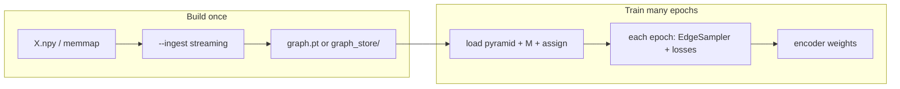
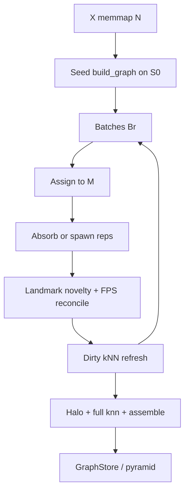

# Streaming cover graph build

**Status:** implementation contract for `--ingest streaming`  
**Complements:** [`leanmap_scale_design_v2.md`](leanmap_scale_design_v2.md) (normative R-band / freeze lifecycle)  
**API:** `leanmap.build.streaming.build_graph_streaming` / `build_graph_pyramid_streaming`

## 1. Why

At \(N\sim 10^7\), a single-pass δ-net + all-rep kNN can dominate walltime and peak RAM even when the **target** is only \(R\in[10^5,10^6]\). Streaming ingest scans \(N\) in batches of size \(B\) (default \(5\times 10^4\)), maintains a growing global cover (landmarks + reps), and refreshes kNN only on **dirty** representatives. The output is the same frozen `Graph` / pyramid artefact training already consumes.

This does **not** replace δ-calibration, ANN/IVF, or disk stages. It changes **how** the cover over raw rows is accumulated.

Lifecycle remains **Build → Freeze → Train**. Streaming is a build-time ingest mode, not per-training-epoch rebuilds.

## 2. How this works in a training run

Streaming does **not** change the train loop. It only changes the **once** that builds the frozen neighbour graph. After freeze, `fit` / `leanmap-train` behave exactly as with a single-pass graph.



### Step-by-step

| Phase | What runs | What is produced / consumed |
|-------|-----------|-----------------------------|
| **1. Build** | `leanmap-graph-build --ingest streaming …` (or `build_graph_pyramid_streaming`) | Growing cover over all of \(N\) in batches; final fuzzy pyramid |
| **2. Freeze** | Same CLI writes the store | `graphs[]`, `M`, `assign_top1/c`, fingerprint, ε/δ, \(k\), \(L\) — same schema as `--ingest local` |
| **3. Train** | `leanmap-train --graph-path …` or `fit(..., graph_path=..., rebuild_graph=False)` | Loads the store; **does not** call streaming again |
| **4. Each epoch** | Existing samplers | Alias-sample edges → expand cells → fuzzy CE; ordinals/geo/density on the **same** frozen cover |
| **5. After fit** | Usual artefact | Encoder (+ landmarks for inference); neighbour graph can be discarded |

**Important:** exemplar policy / `epoch_unit=landmarks` only reweights **which raw rows** appear in SGD batches. They do **not** rebuild topology. Every row that was ingested at build time already has a cell; if it is never drawn this epoch, its edges simply are not sampled.

### Concrete commands

```bash
# Once — pay streaming cost here
leanmap-graph-build --X X.npy --out graph_store/ \
  --ingest streaming --ingest-batch 50000 \
  --delta auto --knn-mode ann --pyramid-scales 3

# Many times / DDP — cheap relative to build at 10M
leanmap-train --X X.npy --graph-path graph_store/ \
  --exemplar-policy sufficient_v1
```

Python equivalent:

```python
from leanmap.build.streaming import build_graph_pyramid_streaming
from leanmap.graph import save_graph_pyramid, tensor_fingerprint
from leanmap import fit, PLANEConfig

graphs, M, a1, ac, report = build_graph_pyramid_streaming(X, metric, ingest_batch=50_000, ...)
save_graph_pyramid(path, graphs=graphs, M=M, assign_top1=a1, assign_topc=ac, ...)
result = fit(X, config=PLANEConfig.for_scale(len(X)), graph_path=path, rebuild_graph=False)
```

### What train reads from the store

Same as any frozen leanmap graph:

- **Always:** `edges` / `weights`, cell CSR (`reps`), landmarks `M`
- **Defaults on:** finest `knn_idx` (density), `member_of` (geo gauge), pyramid levels
- **Not needed at train time:** raw streaming round logs (kept only under `stats.extra["streaming"]` for diagnostics)

### What this is *not*

| Anti-pattern | Reality |
|--------------|---------|
| Rebuild a 50k graph every train epoch | Topology is frozen after build |
| Train only needs edges among this epoch’s rows | The store covers all ingested rows; epochs sample from that global edge mass |
| Call `--ingest streaming` from inside `fit` each epoch | `fit` loads `graph_path` or runs a **single** build if none is cached |

## 3. Algorithm

```text
1. Seed
   - Draw seed indices S0, |S0| = min(seed_size, N) (default seed_size = ingest_batch)
   - Resolve ε (Def-1) and δ (`None`/`eps`/`auto`/float) on the seed (or full X probe)
   - Run standard build_graph on X[S0] → M, local reps, local knn
   - Remap rep_idx / member_of into ambient [0, N)
   - Mark S0 covered

2. For each batch Br of uncovered rows (|Br| ≤ ingest_batch):
   a. Assign Br → landmarks (top-1 / top-c)
   b. Absorb / spawn vs existing reps in top-c basins:
        - if min dist to a basin rep ≤ δ → join that cell
        - else → spawn a new rep at that row
   c. Landmark novelty: if min dist to M > novelty radius
        (max(δ, median 1-NN among landmarks)), queue as candidate
   d. Reconcile M: FPS-truncate M ∪ candidates to n_landmarks
   e. Dirty set = new reps ∪ reps that absorbed mass ∪ prior knn neighbors of those
   f. Refresh knn rows for dirty reps against current X[rep_idx]
   g. Record absorb / spawn / novelty / dirty_R for diagnostics

3. Finalize
   - Ensure every row has member_of ∈ [0, R)
   - Optional halo merge across landmark Voronoi boundaries
   - Full knn_representatives on all reps (quality pass)
   - assemble_graph_from_knn → Graph
   - Optional pyramid_from_finest
   - Freeze via existing GraphStore / save_graph_pyramid
```



## 4. Invariants

| Invariant | Meaning |
|-----------|---------|
| Ambient indices | `rep_idx` and CSR `values` always index into full `X` |
| Cover | After finalize, every row is in exactly one δ-cell |
| R-band | Prefer `delta="auto"` so expected \(R\) stays in \([10^5,10^6]\) at 10M |
| Same reduce | Fuzzy edges only via `assemble_graph_from_knn` (identical math to single-pass) |
| Freeze | Training loads the frozen store; no mid-train topology updates |

## 5. Diagnostics (`StreamingBuildReport`)

Recorded on `Graph.stats.extra["streaming"]` and returned from the API:

| Field | Meaning |
|-------|---------|
| `ingest_batch` / `seed_size` / `n_rounds` | Run config |
| `n_absorbed` / `n_spawned` / `n_novelty_landmarks` | Totals over rounds |
| `rounds[]` | Per-round absorb/spawn/novelty/dirty_R/R |
| `compression_ratio` | \(N/R\) after finalize |
| `knn_overlap` | Optional mean neighbor-set Jaccard vs single-pass `build_graph` on **shared ambient reps** (small-\(N\) audits) |

High absorb rate ⇒ cheap rounds. Persistently high spawn rate ⇒ seed too small or δ too tight; raise seed or use `delta="auto"`.

## 6. CLI

```text
leanmap-graph-build --X X.npy --out graph_store/ \
  --ingest streaming --ingest-batch 50000 \
  --knn-mode ann --delta auto --pyramid-scales 3 \
  --stages graph_stages/
```

`--ingest local` (default) keeps today’s single-pass `build_graph_pyramid`.

## 7. 10M recipe

| Knob | Suggested |
|------|-----------|
| Storage | memmap / `.npy` for `X` |
| `--ingest` | `streaming` |
| `--ingest-batch` | `50000` (raise if basins are huge and spawn rate is high) |
| `--delta` | `auto` |
| `--knn-mode` | `ann` (or `ivf`) |
| `--stages` | on (resume / spill) |
| `--pyramid-scales` | `3` |
| Train | `leanmap-train --graph-path …` with `for_scale` large-N presets (`epoch_unit=landmarks`) |

**When to prefer single-pass (`--ingest local`):** \(N\) already fits comfortably and you want maximum bit-fidelity to the classical pipeline (goldens, small/mid \(N\)).

**When streaming wins:** δ-net / assign over full \(N\) is the wall; most new rows absorb into existing cells so dirty \(R\) stays small each round.

## 8. Quality expectations

Streaming is an **approximate cover**. Fuzzy CE training needs good local neighborhoods and cell membership, not a perfect global kNN. Validate on small \(N\) with `knn_overlap` against `build_graph`; at scale report \(N/R\), absorb/spawn rates, and recall from the final knn pass.

## 9. Non-goals

- Merging unrelated finished full graphs as the quality path
- Epoch-local graphs discarded each train epoch (separate research mode)
- Landmark correspondence without rep absorb/spawn + dirty / final knn
- Claiming bit-identical graphs vs single-pass
