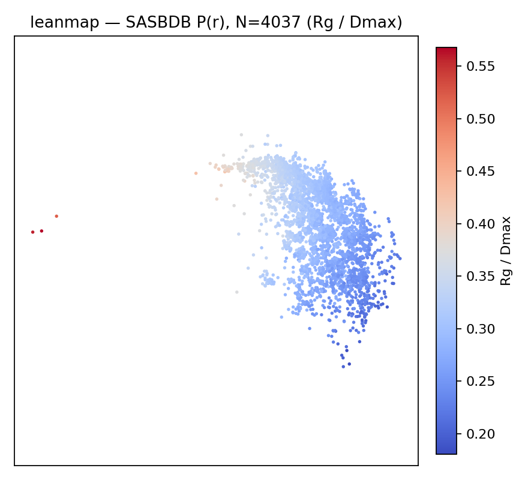
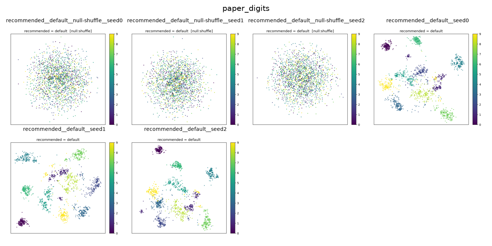
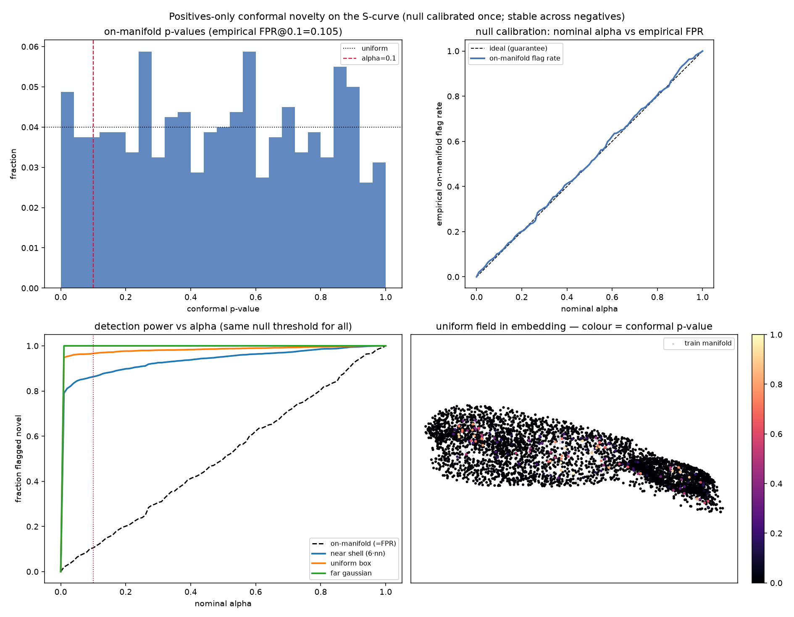

# Research demos

Three curated demos beyond the toy manifolds. They are not part of the paper
battery under [`../exploratory/`](../exploratory/); regenerable outputs land in
`examples/out/research/` (gitignored). Static thumbnails ship in
[`docs/figures/research/`](../../docs/figures/research/).

```bash
pip install -e ".[examples,cpu]"
# SAXS demo also needs: pip install pyarrow
```

## 1. SASBDB P(r) curves

Real SAXS pair-distance distributions embedded with leanmap (L1 on unit-sum
profiles). Colour by Rg/Dmax, peak position, skew, or Dmax.



Data is **not bundled** (~7 MB parquet). Point at a local catalog:

```bash
export LEANMAP_SASBDB_PARQUET=~/Projects/SASDBD/data/catalog/pr_profiles.parquet
# or: --parquet /path/to/pr_profiles.parquet

python examples/research/sasbdb_pr.py
# optional: --n 2000 --epochs 120 for a quicker smoke run
```

Writes `scatter_*.png`, `density.png`, `shepard_ambient.png`, and `metrics.json`
under `examples/out/research/sasbdb_pr/`.

## 2. Digits density preservation

Recommended digits recipe with ambient↔embedding local-density Spearman — a
scorecard axis where leanmap beats UMAP under L2.



```bash
python examples/research/digits_density.py
```

## 3. Conformal novelty on the S-curve

Positives-only conformal calibration: on-manifold false-alarm rate tracks the
nominal α while detection power varies across negative sets.



```bash
python examples/research/novelty_s_curve.py
```
